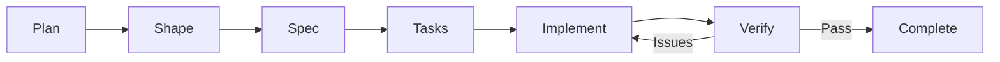

# Agent OS for Woningpaspoort

Agent OS provides a structured workflow for AI-assisted development of Woningpaspoort.

## Configuration

This project is configured for **Cursor** (and other AI coding tools):

```yaml
# agent-os/config.yml
claude_code_commands: false
use_claude_code_subagents: false
agent_os_commands: true
standards_as_claude_code_skills: false
```

## Directory Structure

```
agent-os/
├── config.yml              # Agent OS configuration
├── README.md               # This file
├── standards/              # Coding standards
│   ├── typescript.md       # TypeScript conventions
│   ├── react.md            # React patterns
│   ├── nextjs.md           # Next.js best practices
│   ├── database.md         # Prisma/database standards
│   ├── ui-design.md        # UI/UX guidelines
│   └── security.md         # Security requirements
├── profiles/               # Project profiles
│   └── woningpaspoort.md   # Main project context
├── commands/               # Workflow prompts
│   ├── 01-plan-product.md
│   ├── 02-shape-spec.md
│   ├── 03-write-spec.md
│   ├── 04-create-tasks.md
│   ├── 05-implement-tasks.md
│   └── 06-orchestrate-tasks.md
└── workflows/              # Supporting workflows
    ├── verification.md     # Quality verification
    └── visuals.md          # Visual documentation
```

## Usage with Cursor

### Starting a New Feature

1. **Plan the feature** - Reference `@agent-os/commands/01-plan-product.md`
2. **Shape the spec** - Reference `@agent-os/commands/02-shape-spec.md`
3. **Write detailed spec** - Reference `@agent-os/commands/03-write-spec.md`
4. **Create tasks** - Reference `@agent-os/commands/04-create-tasks.md`
5. **Implement tasks** - Reference `@agent-os/commands/05-implement-tasks.md`
6. **Orchestrate** - Reference `@agent-os/commands/06-orchestrate-tasks.md`

### Applying Standards

When writing code, reference relevant standards:
- `@agent-os/standards/typescript.md` - For type definitions
- `@agent-os/standards/react.md` - For components
- `@agent-os/standards/database.md` - For Prisma schema
- `@agent-os/standards/ui-design.md` - For styling

### Verification

After implementation, use `@agent-os/workflows/verification.md` to ensure quality.

## Quick Reference

### Project Context
- **Target**: Nieuwbouw families, €400K-700K kavels
- **Wedge**: Wkb compliance (mandatory Jan 2024)
- **Moat**: Complete housing DNA
- **Stack**: Next.js 14, tRPC, Prisma, Tailwind

### Key Dutch Terms
| Dutch | English |
|-------|---------|
| Woningpaspoort | Housing Passport |
| Nieuwbouw | New construction |
| Kavel | Building plot |
| Wkb | Quality Assurance Act |
| Consumentendossier | Consumer file |
| Oplevering | Handover |
| Aannemer | Contractor |

### Standards Quick Links
- Types: Follow strict TypeScript, no `any`
- Components: Functional only, hooks pattern
- Database: PascalCase models, camelCase fields
- UI: Dutch language, design system classes

## Workflow Diagram



## Example Prompt

```
I want to add a feature for [feature description].

Please follow the Agent OS workflow:
1. Reference @agent-os/profiles/woningpaspoort.md for context
2. Apply standards from @agent-os/standards/
3. Use the planning workflow from @agent-os/commands/01-plan-product.md
```
