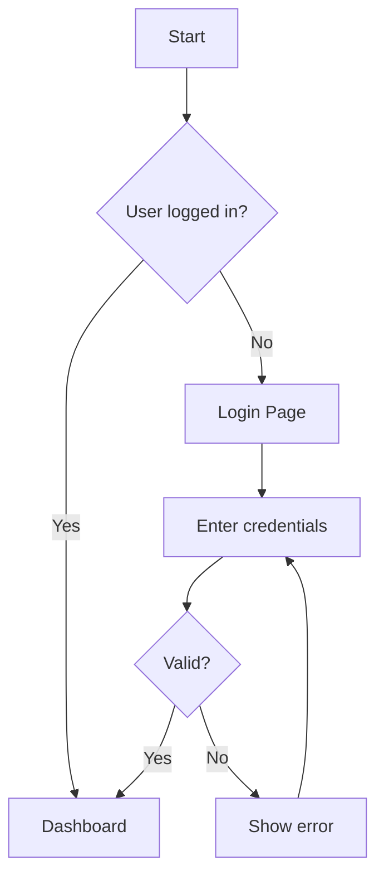

# Visuals Workflow

## Purpose
Define and document visual designs for features before implementation.

## When to Use
- Creating new pages or major UI changes
- Designing complex components
- Establishing new patterns

## Visual Documentation Format

### 1. Component Specification

```markdown
## Component: [Name]

### Purpose
What this component does and when to use it.

### Variants
- Default
- Compact
- Loading
- Error

### Props
| Prop | Type | Default | Description |
|------|------|---------|-------------|
| name | string | required | Display name |
| variant | 'default' | 'compact' | 'default' | Visual variant |

### Visual Design
[ASCII wireframe or description]

### Usage Example
```jsx
<ComponentName 
  name="Example"
  variant="compact"
/>
```

### Accessibility
- Keyboard navigation: [details]
- Screen reader: [details]
- Color contrast: [requirements]
```

### 2. Page Layout Specification

```markdown
## Page: [Name]

### Route
`/path/to/page`

### Layout Structure
```
┌─────────────────────────────────────┐
│ Header (sticky)                     │
├──────────┬──────────────────────────┤
│          │                          │
│ Sidebar  │ Main Content Area        │
│ (fixed)  │                          │
│          │ ┌────────┐ ┌────────┐   │
│          │ │ Card 1 │ │ Card 2 │   │
│          │ └────────┘ └────────┘   │
│          │                          │
└──────────┴──────────────────────────┘
```

### Responsive Breakpoints
- Mobile (< 768px): [behavior]
- Tablet (768-1024px): [behavior]
- Desktop (> 1024px): [behavior]

### Components Used
- Header: `@components/layout/Header`
- Sidebar: `@components/layout/Sidebar`
- Card: `@components/ui/card`

### State Management
- Loading state: [description]
- Empty state: [description]
- Error state: [description]
```

### 3. User Flow Diagram

```markdown
## Flow: [Name]

### Mermaid Diagram


### Step Details
1. **Start**: User navigates to app
2. **Auth check**: System verifies session
3. **Dashboard**: Main app experience
...
```

## Woningpaspoort Visual Patterns

### Cards
```
┌────────────────────────────────────┐
│ ┌──────┐                           │
│ │ Icon │  Title                    │
│ └──────┘  Subtitle                 │
│                                    │
│ Content area with details          │
│                                    │
│ ─────────────────────────────────  │
│ [Action 1]        [Action 2]       │
└────────────────────────────────────┘
```

### Form Layout
```
┌────────────────────────────────────┐
│ Label                              │
│ ┌────────────────────────────────┐ │
│ │ 🔍 Input with icon             │ │
│ └────────────────────────────────┘ │
│ Helper text                        │
└────────────────────────────────────┘
```

### Timeline Item
```
● ─── ┌─────────────────────────────┐
│     │ Title              [Badge]  │
│     │ Description text            │
│     │ 📷 3 photos  🌡️ 18°C       │
│     └─────────────────────────────┘
│
○ ─── [Next item...]
```

### Progress Indicator
```
[Phase 1] ●━━━━━━━━● [Phase 2] ●━━━━━━━━○ [Phase 3]
           100%              75%              0%
```

## Color Usage Guide

| Use Case | Color | Tailwind Class |
|----------|-------|----------------|
| Primary actions | Deep Blue | `bg-primary-600` |
| Success states | Green | `bg-success-500` |
| Verified badges | Purple | `bg-verified-500` |
| Warnings | Orange | `bg-warning-500` |
| Neutral backgrounds | Slate | `bg-slate-50` |
